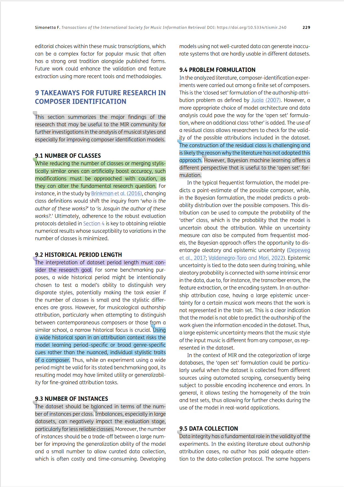
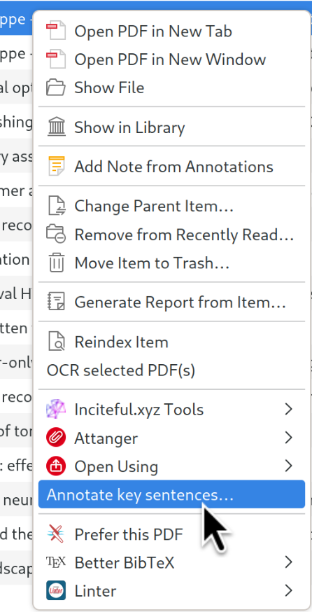
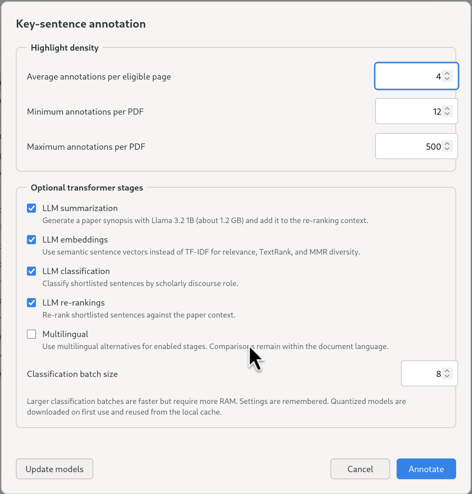

# Zotero Skimming

Say bye-bye to confused AI-generated summaries, abstract sentences, and hallucinations. With this add-on, you can give a first pass to a paper by directly reading its real sentences, no AI invention, only guided AI selection.

First skim, then read. Zotero 9 add-on that speeds up skimming, so you can orientate faster inside a paper.



> [!WARNING]
> Please, be aware of the bias risk induced by automated sentence selection methods. Do not use this add-on for in-depth study of academic articles. Consider it for only fast skimming of articles. Read more about [skimming](#references).

## Installation

1. Download the latest `.xpi` from the [GitHub releases](https://github.com/00sapo/zotero-skimming/releases).
2. In Zotero, open **Tools → Add-ons**.
3. Open the gear menu and choose **Install Add-on From File…**.
4. Select the downloaded `.xpi` and restart Zotero if prompted.

The add-on targets Zotero 9.x. It does not modify source PDFs; it creates native positioned highlight annotations.

## Usage

1. Select a PDF attachment in the Zotero library.
2. Right-click it and choose **Annotate key sentences…**.
  
3. Configure the remote summarization endpoint, API key, and model name. Any OpenAI-compatible API works (OpenAI, Anthropic via litellm, Groq, Deepseek, local vLLM/Ollama, etc.).
  
4. Set the average, minimum, and maximum annotations per PDF.
5. Enable optional local transformer stages (embeddings, classification) as needed.
6. Click **Update models** to download selected local model assets into the Zotero profile cache. This is required only once per selected model and revision.
7. Click **Annotate** to extract, summarize, rank, and annotate. Or click **Summarize** to generate and preview just the paper synopsis.

The baseline ranker works without downloaded models. Summarization always uses the configured remote API. Local transformer failures fall back to TF-IDF for embeddings and skip classification.

## Workflow

### 1. Remote summarization

Paper body text (filtered: no authors, tables, figures, abstract, references) is sent to the configured remote LLM. The summary length scales with the annotation target: approximately `N × 1.5` sentences for `N` requested annotations.

### 2. Sentence embeddings

Sentences are vectorized with a local transformer model (MiniLM-L6 for English, multilingual-e5-small for multilingual). Without LLM embeddings enabled, TF-IDF word/bigram vectors are used instead. The summary text is embedded in the same vector space.

### 3. Sentence ranking

Each sentence is scored by:

```text
0.85 × summary similarity (cosine to summary embedding)
+ 0.15 × sentence-length suitability
```

Summary similarity dominates: sentences semantically close to the synopsis are preferred. Length suitability peaks near 18 words.

### 4. MMR selection

Maximum marginal relevance selects the requested number of highlights while penalizing semantic redundancy, repeated sections, and overlapping summary coverage:

```text
0.65 × importance − 0.35 × redundancy − section penalty − 0.03 × coverage overlap
```

Summary sentences are embedded and tracked: each selection claims the summary sentence it's closest to. Subsequent candidates receive a small penalty if their best-matching summary sentence was already claimed, encouraging the highlights to span different aspects of the synopsis.

### 5. Optional local classification

If enabled, a zero-shot classifier (mobileBERT, ~95 MB) labels each selected sentence with one of six roles. The classifier receives the paper summary concatenated with the sentence as context:

| Role | Description |
|------|-------------|
| contribution | Main contribution of the paper |
| result | Key empirical result or finding |
| method | Core method, approach, or architecture |
| goal | Research objective or aim |
| takeaway | Conclusion or key insight |
| background | Background context or related work |

Classification runs **after** MMR selection — only the final set of highlights is classified. It does not affect sentence ranking; it only sets the annotation color and tag.

### 6. Selected annotations

Selected annotations are restored to PDF reading order and mapped back to their original rectangles.

## Models

All local model assets come from Hugging Face, use q8/legacy quantized ONNX artifacts, and are downloaded explicitly with **Update models**.

| Stage | English | Multilingual |
|-------|---------|-------------|
| Embeddings | `Xenova/all-MiniLM-L6-v2` | `Xenova/multilingual-e5-small` |
| Classification | `Xenova/mobilebert-uncased-mnli` | `onnx-community/multilingual-MiniLMv2-L6-mnli-xnli-ONNX` |

`model-identifiers.json` is the source of truth for these Hugging Face identifiers. MobileBERT's quantized model is approximately 95 MB. `scoring-config.json` contains scoring and selection weights. Edit it to experiment with the algorithm; rebuild the XPI afterwards.

## Build and test

Requirements: Bash, Python 3, `zip`, `unzip`, Node.js, Yarn, and the project's JavaScript test dependencies.

```sh
yarn install
./build.sh
yarn test
yarn coverage
node --check bootstrap.js
node --check content/annotator.js
node --check content/nlp.js
node --check content/model-manager.js
node --check content/model-host.mjs
node --check content/remote-llm.js
git diff --check
```

`build.sh` reads the version from `manifest.json`, creates `dist/zotero-skimming-VERSION.xpi`, includes both JSON configuration files, and validates the archive with `unzip -t`.

## References

- K. Rayner, E. R. Schotter, M. E. J. Masson, M. C. Potter, and R. Treiman, “So Much to Read, So Little Time,” Psychol Sci Public Interest, vol. 17, no. 1, pp. 4–34, Jan. 2016, doi: 10.1177/1529100615623267.
- R. Fok et al., “Scim: Intelligent Skimming Support for Scientific Papers,” Proceedings of the 28th International Conference on Intelligent User Interfaces. ACM, pp. 476–490, Mar. 27, 2023. doi: 10.1145/3581641.3584034.
- G. B. Duggan and S. J. Payne, “Text skimming: The process and effectiveness of foraging through text under time pressure.,” Journal of Experimental Psychology: Applied, vol. 15, no. 3, pp. 228–242, 2009, doi: 10.1037/a0016995.

## Repository

https://github.com/00sapo/zotero-skimming
